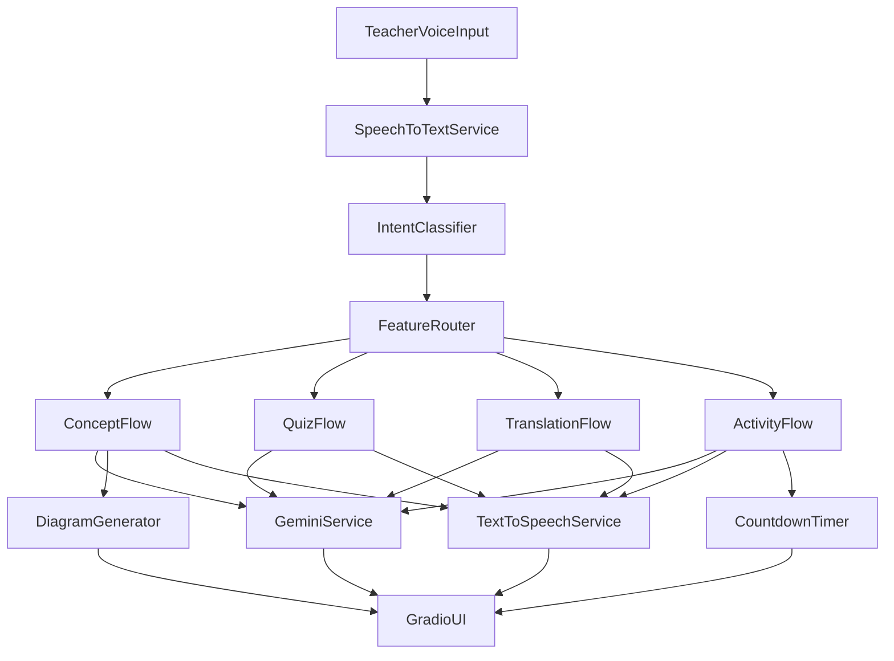

# Classroom Copilot

Classroom Copilot is a voice-enabled AI teaching assistant prototype for classroom sessions.
It helps teachers run live teaching flows using speech commands and returns visual plus audio responses.

## Features

- Live Concept Simplification (Hinglish explanation + diagram + audio)
- Voice Triggered Quizzing (5 MCQs with options and answer key toggle)
- Bilingual Dictation and Translation (English/Hindi support)
- Hands-Free Activity Guide (instructions + automatic countdown timer + audio cue)

## Architecture Diagram



## Setup Instructions

1. Create a Python virtual environment:
   - `python -m venv .venv`
   - `source .venv/bin/activate`
2. Install dependencies:
   - `pip install -r requirements.txt`
3. Configure environment:
   - Edit `.env`
   - Set `GEMINI_API_KEY=your_key_here`
4. Run application:
   - `python app.py`
5. Open the Gradio URL shown in terminal (default: `http://127.0.0.1:7860`)

## Environment Variables

- `GEMINI_API_KEY` (required): Gemini API key
- `WHISPER_MODEL_SIZE` (optional, default: `tiny`)
- `WHISPER_DEVICE` (optional, default: `cpu`)
- `EDGE_TTS_VOICE` (optional, default: `en-IN-NeerjaNeural`)

## Project Structure

```text
classroom-copilot/
├── app.py
├── requirements.txt
├── .env
├── services/
├── prompts/
├── ui/
├── assets/
├── generated_audio/
└── README.md
```

## Demo Instructions

Try these commands:

- "Explain photosynthesis to class 6"
- "Create a quiz on photosynthesis"
- "Translate this paragraph Plants make food using sunlight"
- "Start a 3 minute group discussion activity"

Expected behavior:

- Speech is transcribed
- Intent is classified
- Correct module response is shown
- Audio output is generated
- Timer runs for activity mode

## Screenshots

Add screenshots to `assets/` and reference them here after running the app locally.
