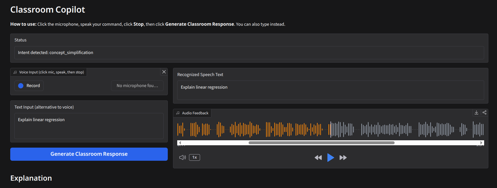
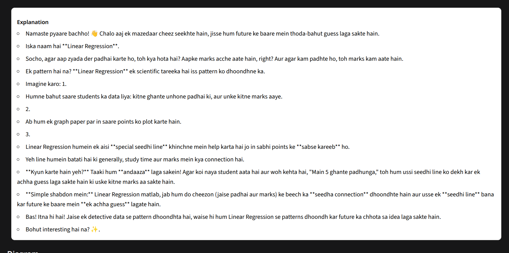
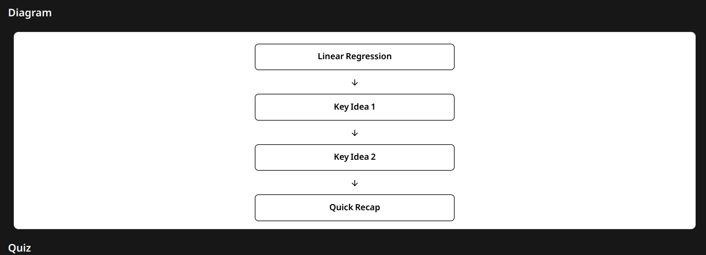
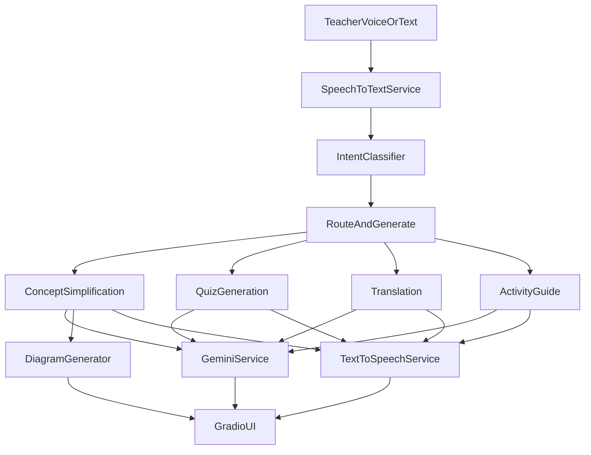

# Classroom Copilot

**Classroom Copilot** is a voice-enabled AI teaching assistant built for government school classrooms. It helps teachers conduct live sessions on a smart board using natural speech or text commands, and returns educational responses with visual content and audio feedback.

The system is designed for **Hinglish (Hindi + English)** classroom communication and supports four core teaching workflows: concept explanation, quiz generation, bilingual translation, and hands-free activity guidance.

---

## Table of Contents

- [Overview](#overview)
- [Features](#features)
- [Screenshots](#screenshots)
- [Architecture](#architecture)
- [Tech Stack](#tech-stack)
- [Project Structure](#project-structure)
- [Prerequisites](#prerequisites)
- [Installation](#installation)
- [Configuration](#configuration)
- [Running the Application](#running-the-application)
- [Usage Guide](#usage-guide)
- [Testing](#testing)
- [Troubleshooting](#troubleshooting)
- [Limitations](#limitations)

---

## Overview

Classroom Copilot is a lightweight prototype focused on:

- **Voice-first interaction** — teachers speak commands with minimal typing
- **Fast classroom response** — quick AI-generated outputs for live teaching
- **Human-centered design** — large, readable UI suitable for smart boards
- **Educational usefulness** — age-appropriate, student-friendly content

Target users are teachers running live classroom sessions. Students are assumed to communicate primarily in Hinglish.

---

## Features

| Feature | Description | Example Command |
|--------|-------------|-----------------|
| **Concept Simplification** | Generates a simple Hinglish explanation with an educational diagram and spoken audio | `Explain photosynthesis to class 6` |
| **Voice-Triggered Quizzing** | Creates 5 easy MCQs with 4 options each; answers can be shown on demand | `Create a quiz on photosynthesis` |
| **Bilingual Translation** | Translates English ↔ Hindi with side-by-side display and audio | `Translate this paragraph Plants make food using sunlight` |
| **Activity Guide** | Produces step-by-step classroom activity instructions with duration | `Start a 3 minute group discussion activity` |

### Additional Capabilities

- Microphone input with text fallback
- Rule-based intent classification (lightweight, no extra LLM call for routing)
- Edge TTS audio output with clean speech formatting
- Graceful fallback when Gemini API is unavailable
- On-demand quiz generation via dedicated UI button

---

## Screenshots

Place application screenshots in the `assets/` folder. The examples below reference the current demo captures:

### Main Interface



### Concept Explanation and Diagram



### Quiz and Activity Output



---

## Architecture



### Processing Flow

1. Teacher provides **voice or text** input.
2. Input is transcribed (if audio) via Faster Whisper.
3. **Intent** is classified using lightweight keyword rules.
4. The appropriate **Gemini service** generates structured educational content.
5. Output is rendered in the Gradio UI (explanation, diagram, quiz, translation, or activity).
6. A clean speech summary is sent to **Edge TTS** for audio playback.

---

## Tech Stack

| Layer | Technology |
|-------|------------|
| UI | Gradio 6 |
| Backend | Python 3 |
| LLM | Google Gemini 2.5 Flash |
| Speech-to-Text | Faster Whisper |
| Text-to-Speech | Edge TTS |
| Configuration | python-dotenv |

---

## Project Structure

```text
classroom-copilot/
├── app.py                  # Application entrypoint
├── requirements.txt        # Python dependencies
├── .env                    # Local environment variables (not committed)
├── assets/                 # Screenshots and static assets
├── generated_audio/        # Temporary TTS output files
├── services/               # Core backend services
│   ├── speech_to_text.py
│   ├── text_to_speech.py
│   ├── gemini_service.py
│   ├── intent_classifier.py
│   └── diagram_generator.py
├── prompts/                # Prompt templates per feature
├── ui/
│   └── gradio_ui.py        # Gradio UI and orchestration layer
├── test_pipeline.py        # Minimal backend pipeline test
├── test_features.py        # Feature-level backend tests
├── CONTEXT.md              # Product and assignment specification
└── CURSOR_RULES.md         # Development guidelines
```

---

## Prerequisites

- Python **3.10+** (tested on 3.14)
- Microphone access (for voice input)
- Internet connection (Gemini API and Edge TTS)
- A valid **Gemini API key**

Optional but recommended for real speech transcription:

```bash
pip install faster-whisper
```

---

## Installation

### 1. Clone the repository

```bash
git clone <your-repo-url>
cd classroom-copilot
```

### 2. Create and activate a virtual environment

```bash
python -m venv venv
source venv/bin/activate        # Linux / macOS
# venv\Scripts\activate         # Windows
```

### 3. Install dependencies

```bash
pip install -r requirements.txt
pip install faster-whisper      # optional, for real microphone transcription
```

### 4. Configure environment variables

Create a `.env` file in the project root:

```env
GEMINI_API_KEY=your_gemini_api_key_here
```

---

## Configuration

| Variable | Required | Default | Description |
|----------|----------|---------|-------------|
| `GEMINI_API_KEY` | Yes | — | Google Gemini API key |
| `WHISPER_MODEL_SIZE` | No | `tiny` | Faster Whisper model size (`tiny`, `base`, `small`, …) |
| `WHISPER_DEVICE` | No | `cpu` | Whisper inference device (`cpu` or `cuda`) |
| `EDGE_TTS_VOICE` | No | `en-IN-NeerjaNeural` | Edge TTS voice for spoken output |
| `STT_USE_MOCK` | No | `false` | Set to `true` to bypass Whisper and use text/mock STT |

---

## Running the Application

```bash
python app.py
```

Open the URL shown in the terminal:

```text
http://127.0.0.1:7860
```

The app binds to `0.0.0.0:7860` by default.

---

## Usage Guide

### Voice Input

1. Click the **microphone** button.
2. Speak your classroom command.
3. Click **Stop** when finished.
4. Click **Generate Classroom Response** (or processing may auto-start after recording stops).

### Text Input

Type a command in the text box and click **Generate Classroom Response**.

### Demo Commands

| Goal | Sample Input |
|------|--------------|
| Explain a concept | `Explain photosynthesis to class 6` |
| Generate a quiz | `Create a quiz on photosynthesis` |
| Translate content | `Translate this paragraph Plants make food using sunlight` |
| Start an activity | `Start a 3 minute group discussion activity` |

### Quiz on Demand

1. Enter a topic in **Quiz Topic** (e.g. `photosynthesis`).
2. Click **Generate Quiz**.
3. Toggle **Show Answers** to reveal the answer key.

### Expected Output

- **Concept** → Hinglish explanation + diagram + audio
- **Quiz** → 5 MCQs with options (+ answers when toggled) + audio summary
- **Translation** → English and Hindi shown side by side + audio
- **Activity** → Title, instructions, steps, duration + audio

---

## Testing

### Backend pipeline test

```bash
python test_pipeline.py
```

Validates: intent → Gemini explanation → TTS audio path.

### Feature-level backend test

```bash
python test_features.py
```

Validates all four feature generators independently.

---

## Troubleshooting

| Issue | Likely Cause | Fix |
|-------|--------------|-----|
| App crashes on button click | Gradio/session issue | Restart the app; ensure latest `ui/gradio_ui.py` is used |
| Microphone not working | Browser permission blocked | Allow mic access for `localhost:7860` |
| Speech not transcribed correctly | Whisper not installed | Run `pip install faster-whisper` |
| No AI response | Missing/invalid API key | Set `GEMINI_API_KEY` in `.env` |
| Blank quiz/diagram text | Theme contrast issue | Refresh browser; content uses forced black-on-white HTML styling |
| `google.generativeai` warning | Deprecated SDK | App still runs; migration to `google.genai` is planned |

---

## Limitations

This is a **prototype**, not production infrastructure. The project intentionally excludes:

- Authentication and user accounts
- Database persistence
- Docker / Kubernetes deployment
- Enterprise scaling patterns

Gemini and TTS outputs depend on network availability and API quotas. Speech quality and latency may vary based on hardware and model size.

---

## License

This project was developed as an AI assignment prototype. Add a license here if you plan to publish or distribute the repository.

---

## Acknowledgements

Built for classroom teaching demonstration with a focus on accessibility, bilingual education, and voice-first interaction for government school environments.
